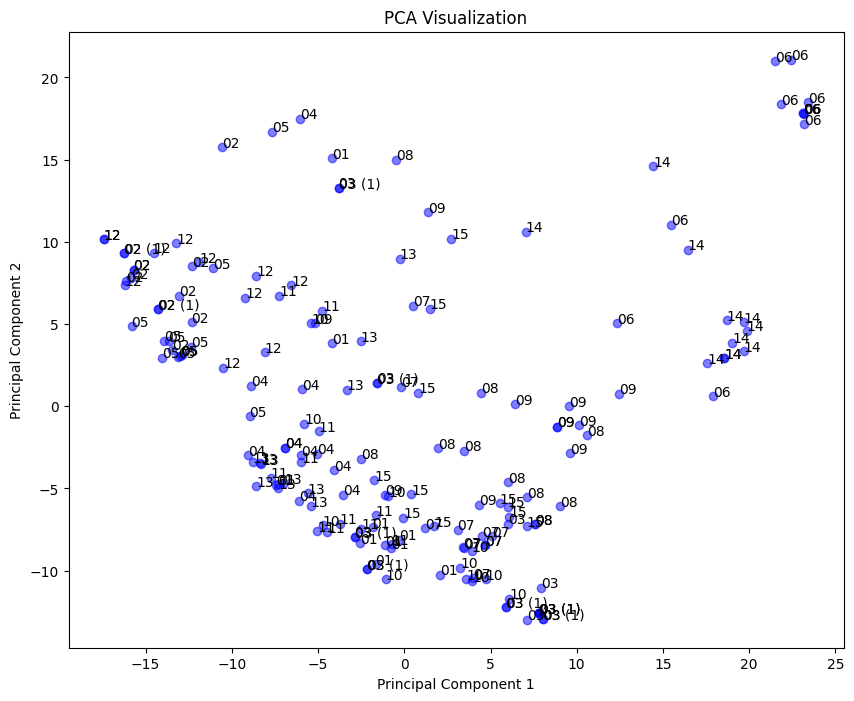
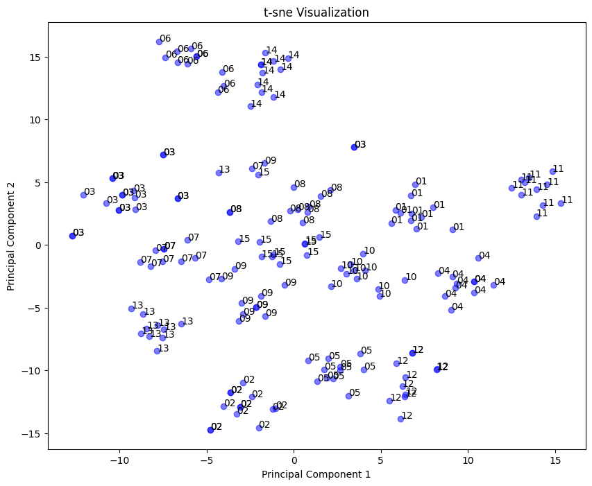
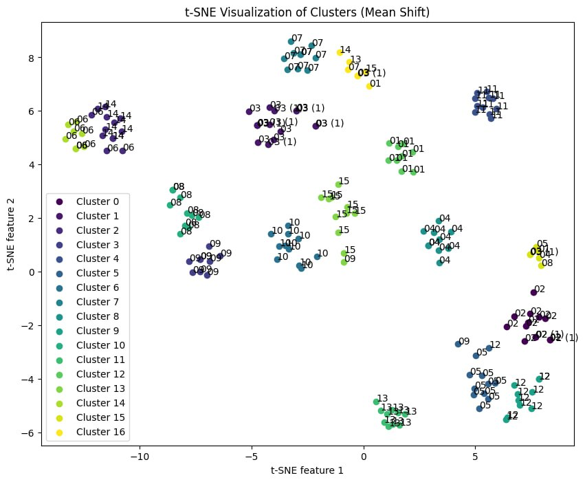
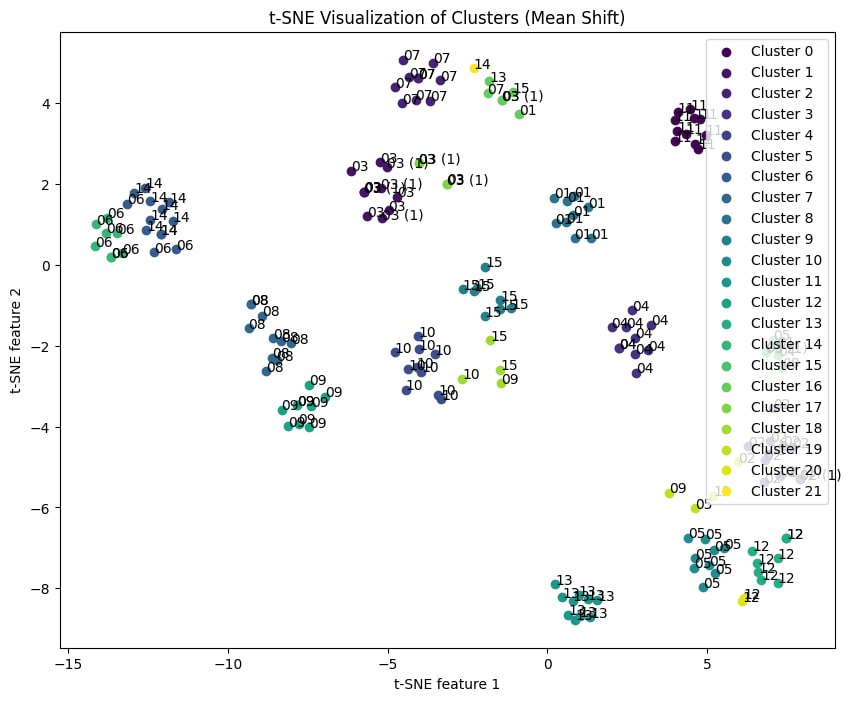

## Introduction
Face clustering is the process of grouping similar faces together in a dataset based on various visual features such as facial appearance, pose, and expression. In this project we will be Clustering a set of images based on the faces recognized using the various clustering algorithms. 

## The process of face clustering typically involves the following steps:

1. **Preprocessing**: Normalize, detect, and extract faces from images while ensuring uniformity in lighting conditions and image quality.
   
2. **Feature Extraction**: Extract discriminative features from the detected faces using techniques such as NP Feature Extraction or Resnet or other feature descriptors like VGG16.

3. **Dimension Reduction**: Reduce the dimensionality of the extracted features to improve computational efficiency and remove noise. Techniques such as Principal Component Analysis (PCA) or t-distributed Stochastic Neighbor Embedding (t-SNE) can be used for this purpose.

4. **Clustering**: Apply clustering algorithms such as K-means, DBSCAN, or Agglomerative clustering to group similar faces based on their feature similarities.

5. **Evaluation**: Evaluate the quality of face clusters using metrics like purity score, Rand index, or adjusted rand index.
   
# 1. Preprocessing

Effective preprocessing is crucial for optimizing the performance of a face detection algorithm. By following these steps, input images can be prepared to enhance the accuracy and efficiency of face detection processes while ensuring robustness to variations in lighting, pose, and facial appearance.

## Steps

### 1. Normalization
- Normalize input images to ensure consistent lighting conditions and pixel intensity across different images.
- Common normalization techniques include mean subtraction, standardization (scaling to have zero mean and unit variance), or min-max scaling.

### 2. Crop & Resize
- Crop the detected face regions from the original images to focus preprocessing steps on the relevant areas.
- Resize the cropped face regions to a standard size suitable for subsequent processing and analysis.
- Commonly used sizes for face detection tasks include 128x128, 224x224, or 256x256 pixels.

### 3. Data Balancing
- Ensure a balanced distribution of face and non-face images in the dataset to prevent bias and improve the generalization capability of the face detection model.

# 2. Feature Extraction
- Feature extraction is the process of reducing the number of resources needed for processing without losing important or relevant information. It helps in the reduction of the dimensionality of data which is needed to process effectively.
  
### Comparison of the methods that we used
| Aspect                | NP Feature Extraction | ResNet                         | VGG16                           |
|-----------------------|-----------------------|--------------------------------|---------------------------------|
| Architecture          | Neural Processes      | Deep Convolutional Neural Network | Deep Convolutional Neural Network |
| Feature Extraction    | Learned feature representation capturing both context and uncertainty | Hierarchical feature representation capturing semantic information | Hierarchical feature representation capturing semantic information |
| Model Complexity      | Moderate              | High                           | High                            |
| Training Data         | Few-shot learning     | Large-scale labeled data      | Large-scale labeled data       |
| Generalization        | Potentially better generalization with few-shot learning capability | Good generalization due to depth and skip connections | Good generalization due to depth and multiple convolutional layers |
| Application           | Particularly useful for tasks with limited labeled data or uncertainty estimation | Wide range of computer vision tasks | Wide range of computer vision tasks |
| Pretrained Models     | Few-shot learning framework allows for transfer learning with minimal data | Pretrained models readily available for transfer learning | Pretrained models readily available for transfer learning |
| Computational Efficiency | Generally lower computational requirements due to fewer parameters | Higher computational requirements due to deeper architecture | Higher computational requirements due to deeper architecture |

# 3. Dimension Reduction
- When working with high-dimensional data, It can be challenging to visualize, explore, and cluster it. That's why dimensionality reduction techniques are so useful

1. **PCA**
- PCA is a linear technique that transforms your data into a new coordinate system, where the axes are called principal components. The first principal component captures the most variance in your data, the second one captures the most variance that is orthogonal to the first one. PCA is fast, scalable, and easy to interpret, but it assumes that your data is linearly correlated, which means that it can miss nonlinear patterns and structures.
   
2. **t-SNE**
- t-SNE is a nonlinear technique that tries to preserve the local distances and neighborhoods in THE data. It works by creating a low-dimensional map, where each point represents a high-dimensional observation, and adjusting the positions of the points until they match the original distances as much as possible. t-SNE is great for finding clusters and patterns in complex data, especially when they are not separable by a linear boundary. t-SNE can also reveal hidden features and structures that PCA might miss.
  
### Which to choose
t-SNE can preserve the spatial relationship between data points after reducing the dimensionality of the data. It means that the nearby data (points with similar characteristics) in the original dimension will still be nearby in the lower dimension. That is why t-SNE is mostly used to find clusters in the data.
t-SNE can handle non-linear data which is very common in real-world applications.
PCA tries to reduce dimensionality by maximizing variance in the data while t-SNE tries to do the same by keeping similar data points together (and dissimilar data points apart) in both higher and lower dimensions.
Because of these reasons, t-SNE can easily outperform PCA in dimensionality reduction.

    
    

 

# 4. Clustering

## K-means

### Determining the Optimal Number of Clusters (k) using the Elbow Method

One of the challenges in k-means clustering is determining the appropriate number of clusters (k) for the dataset. The elbow method is a popular technique used to find the optimal value of k. Here's how it works:

1. **Run k-means for a Range of Values**: First, run the k-means algorithm for a range of values of k. We choose a range of k values, from 10 to 20.

2. **Compute the Within-Cluster Sum of Squares (WCSS)**: For each value of k, we computed the sum of squared distances between each point and its assigned centroid. This metric is also known as the within-cluster sum of squares (WCSS).

3. **Plot the Elbow Curve**: At last, we plotted a graph where the x-axis represents the number of clusters (k), and the y-axis represents the corresponding WCSS values. As k increases, the WCSS will decrease because clusters become smaller. However, beyond a certain point, the rate of decrease in WCSS slows down.

4. **Identify the Elbow Point**: Then you look for the "elbow" or bend in the curve, where the rate of decrease in WCSS starts to flatten out. The point at which adding more clusters does not significantly decrease the WCSS is considered the optimal number of clusters.

5. **Select the Optimal k**: Once you identify the elbow point, you can select the corresponding value of k as the optimal number of clusters for your dataset.

The elbow method provides a heuristic approach to determine the number of clusters in k-means clustering. However, it's important to note that the elbow point may not always be clearly defined, especially in complex datasets. In such cases, additional techniques or domain knowledge may be necessary to make an informed decision about the number of clusters.

## DBSCAN Clustering

DBSCAN (Density-Based Spatial Clustering of Applications with Noise) is a clustering algorithm known for its ability to identify clusters of varying shapes and sizes in a dataset.

### Hyperparameters

- **eps**: The maximum distance between two samples for them to be considered as in the same neighborhood.
- **min_samples**: The number of samples (or total weight) in a neighborhood for a point to be considered as a core point.

### Setting Hyperparameters

The hyperparameters for DBSCAN were set through a process of trial and error:

1. **Initial Values**: Initially, default values or educated guesses were used for the hyperparameters.
2. **Experimentation**: The algorithm was run with different combinations of hyperparameter values.
3. **Evaluation**: The performance of DBSCAN clustering was evaluated using metrics such as silhouette score, cluster coherence, or domain-specific measures.
4. **Refinement**: Based on the evaluation results, the hyperparameters were refined iteratively to improve clustering performance.
5. **Validation**: Finally, the selected hyperparameters were validated on unseen data or using cross-validation techniques to ensure generalization.

The specific values of `eps` and `min_samples` were chosen based on their ability to produce meaningful clusters in the dataset while minimizing noise.

## Agglomerative Clustering

Agglomerative clustering is a hierarchical clustering technique that recursively merges the closest pairs of clusters based on a linkage criterion.

### Linkage Modes

Agglomerative clustering can be performed using different linkage modes, including:

- **Single Linkage**: Merge the two clusters that have the smallest minimum pairwise distance.
- **Complete Linkage**: Merge the two clusters that have the smallest maximum pairwise distance.
- **Average Linkage**: Merge the two clusters that have the smallest average pairwise distance.

### Testing and Comparison
To evaluate the performance of Agglomerative Clustering with different linkage modes, the following steps were taken:

1. **Implementation**: Agglomerative clustering was implemented using the three linkage modes.
2. **Clustering**: The dataset was clustered using each linkage mode.
3. **Evaluation Metrics**: Purity and Rand index were chosen as evaluation metrics.
4. **Comparison**: Purity measures the extent to which clusters contain instances of a single class, while Rand index measures the similarity between two clustering assignments. Both metrics were calculated for each clustering result.
5. **Comparison Analysis**: The purity and Rand index scores were compared across the different linkage modes to determine which mode produced the most coherent and accurate clusters.

### Results

The results of the comparison are summarized as follows:

| Linkage Mode   | Purity Score | Rand Index Score |
|----------------|--------------|------------------|
| Single Linkage | 0.753 | 0.915   |
| Complete Linkage | 0.787| 0.932 |
| Average Linkage | 0.817| 0.970  |

Based on the evaluation metrics, the best-performing linkage mode was Average, as it achieved the highest purity and Rand index scores.

## Mean Shift Clustering

Mean Shift clustering is a non-parametric clustering algorithm that does not require specifying the number of clusters a priori. It works by iteratively shifting data points towards the mode (peak) of the data distribution until convergence.

Mean Shift clustering has one main hyperparameter:

- **Bandwidth**: The bandwidth parameter determines the size of the kernel used to estimate the density of data points. It influences the smoothness of the density estimate and, consequently, the shape and number of clusters discovered.
  
Initially, a range of bandwidth values was selected and we started using trial and error by using 4th phase evaluation methods to find a suitable bandwidth for this algorithm.

# Gaussian Mixture Model (GMM) Clustering

Gaussian Mixture Model (GMM) clustering is a probabilistic model that represents the distribution of data points as a mixture of several Gaussian distributions (also called components) with unknown parameters. In GMM, each data point is assumed to belong to one of the Gaussian distributions with a certain probability.

### How it works

1. **Probability Density Function**: GMM assumes that the data points are generated from a mixture of multiple Gaussian distributions, each characterized by its mean and covariance matrix. The probability density function of GMM is given by the weighted sum of the probability density functions of individual Gaussian distributions.

2. **Expectation-Maximization (EM) Algorithm**: GMM parameters, including the means, covariances, and weights of the Gaussian components, are typically estimated using the Expectation-Maximization (EM) algorithm. The EM algorithm iteratively updates the parameters to maximize the likelihood of the observed data.

3. **Soft Clustering**: Unlike k-means, which assigns each data point to a single cluster, GMM provides soft assignments where each data point is associated with each cluster with a certain probability. This allows GMM to capture complex data distributions and handle overlapping clusters.

### Advantages

- **Flexibility**: GMM can model complex data distributions with overlapping clusters, making it suitable for datasets with non-linear boundaries and mixed memberships.
- **Probabilistic Framework**: GMM provides probabilistic cluster assignments, allowing for uncertainty estimation and interpretation of cluster membership probabilities.
- **Soft Clustering**: GMM offers soft clustering, enabling the identification of data points with ambiguous cluster memberships.
- **Scalability**: GMM scales well with large datasets and can handle high-dimensional data.

# Spectral Clustering in Face Detection

Spectral Clustering is a powerful technique used in clustering analysis that leverages the eigenvalues of a similarity matrix derived from the data. In face detection, Spectral Clustering can be applied to group similar facial images together based on their features, aiding in tasks like face recognition, facial expression analysis, and clustering of facial attributes.

## How it Works

1. **Similarity Graph Construction**: The first step involves constructing a similarity graph from the facial images dataset. Each node in the graph represents a facial image, and the edges between nodes indicate the similarity between images. The similarity can be computed using various metrics like Euclidean distance, cosine similarity, or kernel functions.

2. **Eigenvalue Decomposition**: Next, the Laplacian matrix of the similarity graph is computed. This matrix characterizes the pairwise relationships between the facial images. Eigenvalue decomposition is then applied to the Laplacian matrix to obtain its eigenvectors and eigenvalues.

3. **Dimensionality Reduction**: The eigenvectors corresponding to the smallest eigenvalues are selected to form a low-dimensional representation of the data. This step effectively reduces the dimensionality of the dataset while retaining important structural information.

4. **Clustering**: In the reduced-dimensional space, traditional clustering algorithms like k-means or normalized cut can be applied to partition the data into clusters. Spectral Clustering often yields better-defined clusters compared to methods like k-means, especially when dealing with non-linearly separable data.

## Advantages

- **Robustness to Data Structure**: Spectral Clustering is effective at identifying complex and non-linear structures in the data, making it suitable for capturing the intricate variations present in facial images.
  
- **Flexibility**: It can accommodate different types of similarity measures and kernel functions, allowing for customization based on the specific characteristics of the facial data.

- **Scalability**: Spectral Clustering can handle large datasets efficiently, making it suitable for applications involving a large number of facial images.

## Limitations

- **Parameter Sensitivity**: Spectral Clustering requires tuning of parameters such as the number of clusters and the similarity threshold, which can influence the clustering results and may require domain knowledge or manual intervention.

- **Computational Complexity**: The eigenvalue decomposition step can be computationally expensive, especially for large datasets. Additionally, the choice of the nearest neighbors for constructing the similarity graph can impact both the computational complexity and the quality of clustering.

- **Interpretability**: While Spectral Clustering produces effective clustering results, the interpretation of the clusters may not always be straightforward, especially in high-dimensional spaces like facial feature representations.

# Evaluation

## K-Means
Since we had different methods of preprocessing we used a wide selection of them, In this clustering we used Normalizing and Resizing, Face Detection and DataBalancing. Using k=15 we reached the results below and will discuss the results further.

| Purity Score | Rand Index Score | Adjusted Rand Index Score |
|--------------|------------------|------------------|
| 0.925        |   0.982   |  0.848 |

### Exceptions in clustering 

    
Similarity in their nose and being bold

    

        
        
    

     

    
Picturs with poor lighting quality

    

        
        
    

     

    
Faces that partially have similar structure

    

        
        
    

     

## DBSCAN
In this clustering, We used the raw data provided by TAs and had the following results.

| Purity Score | Rand Index Score | Adjusted Rand Index Score |
|--------------|------------------|------------------|
| 0.868        |   0.962   |  0.685 |

Using this algorithm we had problems clustering images with poor lighting but reached great results in other aspects.

Here are some examples that light shines from the side and were not detected by the algorithm.

    

        
        
    

    

        
        
    

## MeanShift
Having higher bandwidth results in a larger kernel size for density estimation. This leads to a smoother density estimation, where points that are farther away from each other are considered part of the same cluster. As a result, clusters tend to merge, and the number of clusters decreases.

    

 

Decreasing the bandwidth results in a smaller kernel size for density estimation, which leads to higher resolution in identifying clusters. Points must be closer to each other to be considered part of the same cluster, resulting in more compact and separated clusters.

    

Smaller bandwidth values can make MeanShift clustering more sensitive to noise in the data. Small fluctuations in density can result in the formation of spurious clusters or the splitting of genuine clusters into smaller fragments.
 

## Agglomerative

## Complete
Complete linkage tends to produce clusters that are more compact and spherical, as it considers the maximum distance between any two points in different clusters when merging.
This can be advantageous in face detection when the clusters represent distinct facial features or expressions.

    

        
        
    

    

        
        
    

## Single
Single linkage, on the other hand, can produce elongated and irregularly shaped clusters because it only considers the minimum distance between points from different clusters when merging. This may lead to less compact clusters, which could affect the accuracy of face detection algorithms, especially in cases where facial features are not well-separated.

    
Having the same ethnicity

    

        
        
    

     

## Contributors

This project was created and maintained by the following individuals:

- [Mohammad Mohamadian](https://github.com/MAMMAD1381)
- [MohammadReza MirRashid](https://github.com/mmdreza00mirrashid)